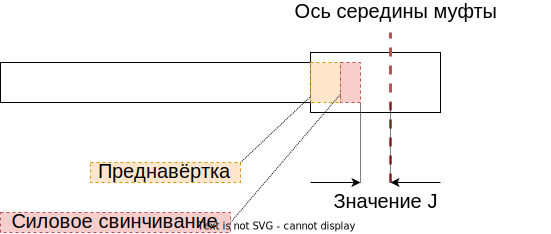

# Список рабочих параметров / шагов

## Общие параметры

- **Обороты на открытие навёрточной головки** - Количество оборотов, которое требуется выполнить чтобы раскрыть головку - можно вынимать трубу

- **Обороты на развинчивание** - Количество оборотов, при цикле "развинтить"

- **Программа SPS №** - Номер программы в ПЛК с уставками путей

- **Тип резьбы** - правая / левая
- **Шаг резьбы** - длина/оборот

## Измерение длины муфты

Оператор вводит следующие параметры: 
- **Длина муфты, минимальная**
- **Длина муфты, максимальная**
- **Время наблюдения**

В качестве результата, добавляются:
- **Результат ПЛК/Измерение длины муфты**
- **Начало операции**
- **Конец операции**

## Предварительное свинчивание
Оператор вводит следующие параметры: 
- **Мин длина предварительного свинчивания**
- **Макс длина предварительного свинчивания**
- **Время наблюдения**

В качестве результата, добавляются:
- **Результат ПЛК/Предварительное свинчивания**
- **Длина предварительного свинчивания**
- **Начало операции**
- **Конец операции**

## Силовое свинчивание

Набор рабочих параметров на силовом свинчивании зависит от выбора режима свинчивания:

- Контроль момента
- Контроль момента и выступа (заплечника, shoulder)
- Контроль длины
- Контроль длины и момента
- Контроль значения J
- Контроль значения J и момента

Независимо от выбранной программы, оператор вводит следующие параметры:

- **Базовый крутящий момент** - Значение крутящего момента, где измерительный контроллер начинает записывать крутящий момент
- **Крутящий момент сброса** - Крутящий момент, при котором происходит останов свинчивания.
- **Крутящий момент автосохранения** - Крутящий момент, при котором система ПЛК останавливает запись соединения
- **Время наблюдения** - Максимальное время рабочего шага

Далее, в зависимости от выбранной программы, оператор вводит дополнительно следующие параметры:

### Если выбран контроль момента

- **Мин. Крутящий момент** - Минимальный крутящий момент для оценки
- **Макс. Крутящий момент** - Максимальный крутящий момент для оценки
- **Оптимальный крутящий момент** - Крутящий момент согласно спецификации производителя
- **Уменьшение скорости 1 крутящего момента** - Порог крутящего момента для уменьшения первой скорости наверточной головки
- **Уменьшение скорости 2 крутящего момента** - Порог крутящего момента для уменьшения второй скорости наверточной головки

Если выбран контроль момента и выступа, то в дополнение к параметры выше, оператор вводит:

- **Мин. Крутящий момент плеча** - Заданное значение для минимального крутящего момента плеча
- **Порог крутящего момента плеча** - Порог для значения крутящего момента плеча
- **Макс. Крутящий момент плеча** - Заданное значение для максимального крутящего момента плеча
- **Макс. Уклон плеча** - Порог при котором график крутящего момента круто возрастает. Т.е. когда резьба достигает плеча и свинчивание останавливается
- **Тип оценки плеча** - Алгоритм: Онлайн или Офлайн
- **Коэффициент уклона** - Определяет уклон линии наклона
- **Крутящий момент дельты уклона плеча** - Размер шага крутящего момента (% от оптимального крутящего момента) Данные проанализированы с использованием этого размера шага для нахождения плеча

### Если выбран контроль длины

- **Минимальная длина** - Минимальная длина, глубина свинчивания, относящаяся к длине муфты
- **Максимальная длина** - Максимальная длина, глубина свинчивания, относящаяся к длине муфты
- **Сброс длина** - Окончание свинчивания при длине: наверточная головка останавливается в зависимости от глубины свинчивания
- **Уменьшение скорости 1 при длине** - Порог длины для уменьшения первой скорости наверточной головки
- **Уменьшение скорости 2 при длине** - Порог длины для уменьшения второй скорости наверточной головки

Если выбран контроль момента и длины, то в дополнение к параметры выше, оператор вводит:

- **Максимальный крутящий момент** - Используется при контроле момента
- **Минимальный крутящий момент** - Используется при контроле момента

### Если выбран контроль значения J



```
Значение J = (Длина муфты / 2) - (глубина быстрого свинчивания + Глубина силового свинчивания)
```
- **Минимальное значение J** - Минимальное значение J, глубина свинчивания относительно центра муфты, для оценки
- **Максимальное значение J** - Максимальное значение J, для оценки
- **Сброс значения J** - Сброс, при значении относительно центра муфты. Значение при котором свинчивание останавливается
  
Если выбран контроль момента и значения J, то в дополнение к параметры выше, оператор вводит:

- **Максимальный крутящий момент** - Используется при контроле момента
- **Минимальный крутящий момент** - Используется при контроле момента


