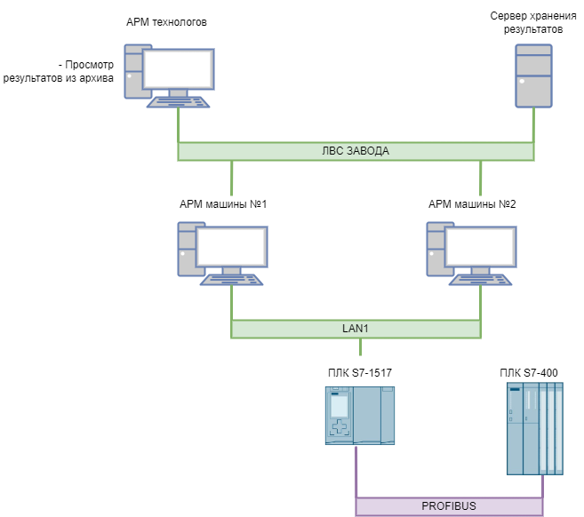

# Структурная схема

Система состоит из двух АРМов, которые расположены на пультах управления, рядом с оборудованием навертки, сервера хранения, на который АРМы отсылают данные по свинчиванию деталей, и клиента, для просмотра этих данных.

АРМ оператора располагается по месту установки силовой навертки. Монитор врезан в пульт управления установкой. Информация в АРМ вводится при помощи клавиатуры с трекболлом. 

ПЛК S7-1517 заменяет контроллер Easy, который собирал показания датчиков оборота и момента. Так же, через этот ПЛК выполнена коммуникация между АРМ и ПЛК S7-400.