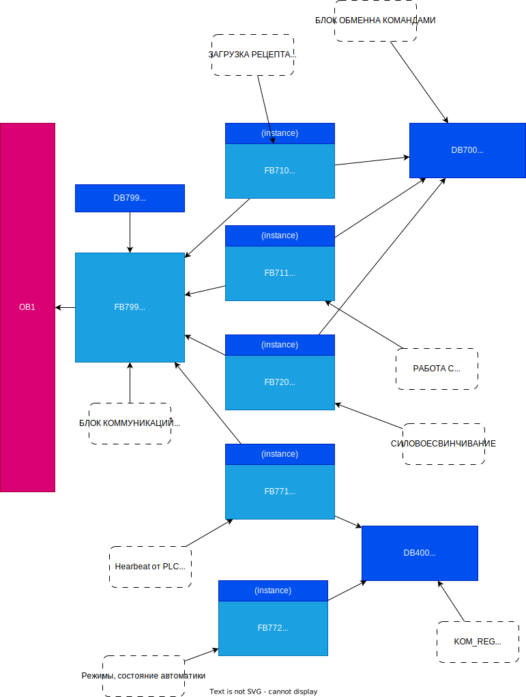

# Сведения о программе ПЛК400

Установка состоит из двух машин силовой навёртки, двух машин предварителной навёртки, и подачи муфт. 

Для каждой машины установлен свой АРМ. На АРМ выполняется программа. Для коммуникации между программой и ПЛК созданы блоки. Блоки названы и содержат похожий код для каждой из двух машин. Почему они не использовали один и тот же блок но с разными дб – не известно. Рассмотрим алгоритм на примере машины 1.

В программе встречаются следующие сокращения, или имена:
- TPC – Программное обеспечение установленное на АРМSPS – ПЛК 400
- REZ – Рецепт (программа). Данные, необходимые для соединения (силовой навертки)
- MP – Machin Parameter. Конфигурация машины. Базовые настройки, неизменные во время работы 
- BA – Betriebsarten – Режим работы 
- kraftschrauber, CAM, MU – Makeup, Силовая навёртка
- vorschrauber, MVS - Преднавёртка 
- ML - Муфтовый лифт 
- MB – Смазка муфт

## Структура программы в контексте обмена данными

### OB1
Вся программа находится в блоке OB1. Хотя в ПЛК есть и другие OB, Они используются для диагностики и не содержат вложенных блоков

### (1)FB_Komm

Общий блок коммуникаций для машины 1. Здесь собраны и вызываются все блоки коммуникаций между TPC, SPS И EASY. 

### FB_TPC_REZ

Управление загрузкой рецепта из TPC В ПЛК

Блок вызывается в (1)FB_Komm и использует instance DB в этом блоке. Неявно (т.е. из кода, а не через интерфейс блока) из блок обращается к следующим DB:
- DB700 KOM_REG_SP - Блок обмена коммандами TPC, PLC, EASY, SPS

Управление загрузкой рецепта выполняется при помощи команд. 
Команды – это некоторая переменная типа Dword, В которую записывается номер команды. 
По номеру программы, ПЛК и TPC Выполняют некоторые действия над данными.С помощью команд выполняется согласование действий TPC И ПЛК.

Интерфейс блока:

__Входы__:
- Frg_Rez – Флаг, разрешающий загрузку нового рецепта. 
  
  Предположительно, разрешение формируется либо если включен ручной режим, либо если автоматический. В обоих режимах проверяется состояние разных процессов работы механизации, таких как смазка, преднавёртка и другие циклы.

__Выходы__:
- TPC_Rez_Neu – Обнаружен новый рецепт
- TPC_Rez_Akt – Загрузка рецепта завершена 
- 
__Вход/Выход__:
- EASY_Rez_akt – Текущие параметры EASY Доступны. Не используется (нет ссылок)
- TPC_Rez_neu_IO – Новые данные приняты. Не используется (нет ссылок)

В этом блоке выполняется применение нового рецепта от TPC. TPC Записывает данные в блок 401, а в этом блоке происходит копирование в другие блоки.Так же тут выполняется работа с Easy.
Причем, применение нового рецепта может произойти просто по команде от TPC, если TPC Не соблюла алгоритм передачи.

Алгоритм загрузки нового рецепта из TPC в ПЛК реализованный в этом блоке:

## Задачи

- Состав рецепта (рабочих данных)
- Процедура загрузки рецепта в ПЛК
- Состав оперативных параметров
- Состав результата соединения
- Процедура получения результата соединения