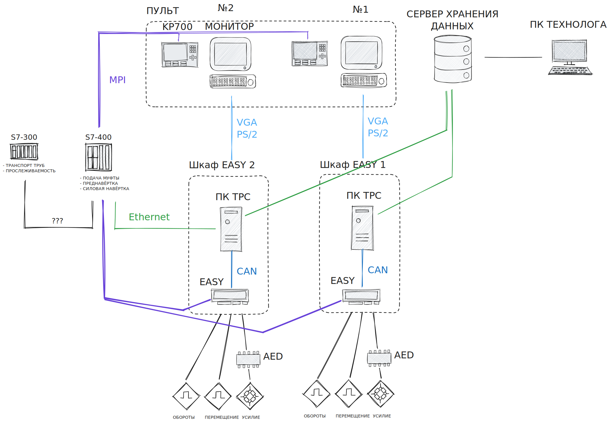
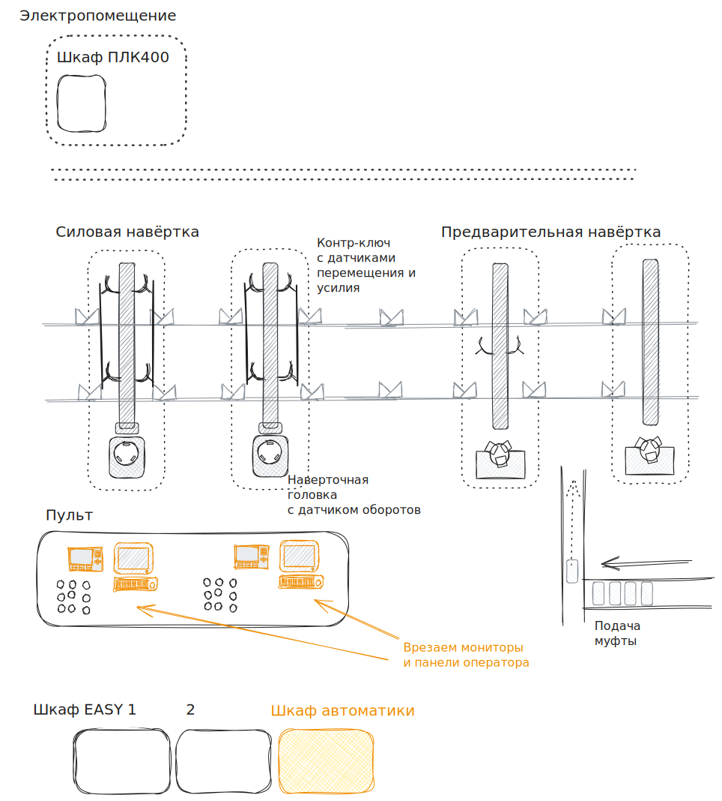
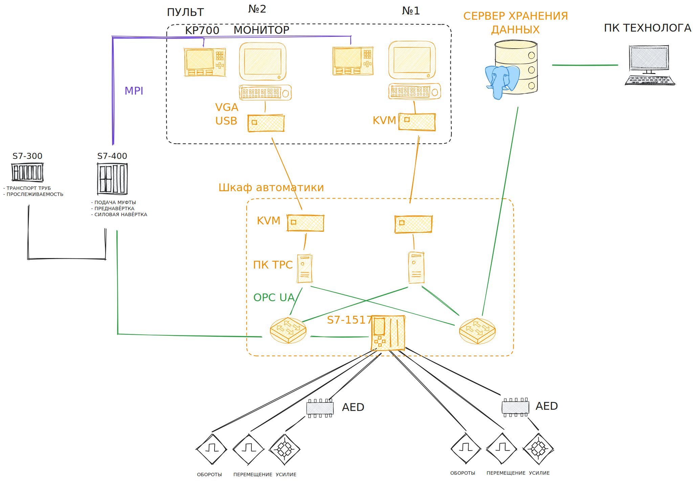

# Муфтонавёртка

## Объём модернизации. Обзор существующей системы

### План участка

### Структурная схема

### Изменения на плане

### Изменения в структуре

## История работы с проектом

### 06.2024 

### Первичные обследования

### Разработка ПО

### Обследование easy и платы тензометрии

### Отладка ПО

## Незавершённый объём работ
👉 Цель: Показать, что система ещё не готова к эксплуатации, и почему

### Отладка функционала

### Интеграция с верхним уровнем

### Свинчивания с заплечником

### Монтаж оборудования

## Риски и проблемы
👉 Цель: Подчеркнуть, что без решения орг. вопросов — техника не спасёт

## Как сохранить работоспособность существующей системы?
